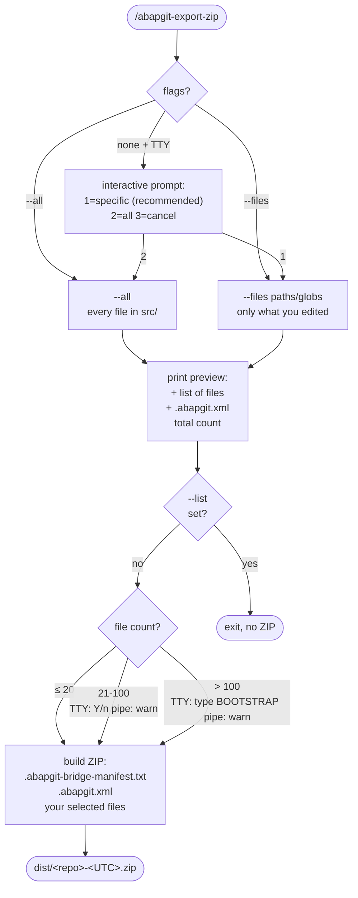

# /abapgit-export-zip

Pack a **user-chosen subset** of `src/` plus `.abapgit.xml` into a ZIP that ZGIT_BRIDGE / ZABAPGIT_STANDALONE can import. The developer (or agent) picks what goes in — the script does NOT auto-detect changes.



## Why user-chosen scope

Every file in the ZIP gets deserialised by SAP and written to the transport. In a package shared with other developers, including a file you didn't actually edit risks clobbering their object and pulling it into your transport. Picking only what you changed keeps the blast radius minimal.

## Usage

```
/abapgit-export-zip                                              # interactive prompt
/abapgit-export-zip --all                                        # everything in src/
/abapgit-export-zip --files src/zcl_foo.clas.abap src/zcl_foo.clas.xml
/abapgit-export-zip --files "src/zcl_foo*"                       # globs OK (recursive: src/**/zcl_foo*)
/abapgit-export-zip --list --files "src/zcl_foo*"                # preview, no ZIP
/abapgit-export-zip --all --out ~/push.zip
/abapgit-export-zip --files src/zcl_foo.clas.abap -m "round 2 fix"
```

## Flags

| Flag | Effect |
|---|---|
| `--all` | Include every file under `src/`. |
| `--files <paths>` | Explicit list. Paths or globs, relative to repo root. Mutually exclusive with `--all`. |
| `--list` | Print what would be packed and exit; build no ZIP. |
| `--out <path>` | Custom output path. Default: `dist/<repo>-<UTC>.zip`. |
| `-m, --message <text>` | Note recorded in the ZIP's manifest only — no git side effects. |

If neither `--all` nor `--files` is given and stdin is a TTY, the script prompts:

```
src/ contains 152 files. What should go in the ZIP?
  (1) specific files      (paste paths or globs, one per line, blank ends)
                          ^ recommended for incremental work — minimum blast radius
  (2) all 152 files       [writes 152 objects to transport — bootstrap or full re-sync]
  (3) cancel
```

If stdin is not a TTY (agent pipe), one of `--all` or `--files` is required.

## File-count thresholds

| Count | TTY | No TTY |
|---|---|---|
| ≤ 20 | proceed | proceed |
| 21 – 100 | soft `[Y/n]` confirm | warn-and-proceed |
| > 100 | require typed `BOOTSTRAP` | warn-and-proceed |

Designed so that bootstrap-sized exports demand a deliberate confirmation, while small per-round pushes feel frictionless.

## What goes in the ZIP

```
.abapgit-bridge-manifest.txt   # timestamp, scope, file count, optional -m note
.abapgit.xml                   # at root - always included if present
src/<your selection>           # whatever you picked (or all of src/ for --all)
```

`.abapgit.xml` is always included automatically (abapGit needs it to know the package and folder logic). It is not counted toward the threshold.

## What is NOT in the ZIP

**Anything you did not select.** Files in `src/` you did not pick are not in the ZIP and SAP will not touch the corresponding objects.

**Deletions.** abapGit ZIP import only adds and updates — it does not delete. If you removed a file from `src/`, the SAP-side object still exists. Delete manually in SE80 (programs/classes), SE14 (tables), or appropriate transaction. This is deliberate: an accidental table deletion takes the data with it.

## Manual cycle

```mermaid
sequenceDiagram
    participant Dev as Developer + Claude
    participant Disk as Laptop disk
    participant SAP as SAPGUI / SAP

    Dev->>Disk: edit src/*.abap
    Dev->>Disk: /abapgit-export-zip<br/>(pick scope)
    Disk-->>Dev: dist/&lt;repo&gt;-&lt;UTC&gt;.zip
    Dev->>SAP: transfer ZIP
    SAP->>SAP: Import ZIP<br/>pick transport, F8
    SAP->>SAP: deserialize + activate
    alt all green
        SAP-->>Dev: "all clean"
    else errors
        SAP-->>Dev: capture log .txt
        Dev->>Disk: /abapgit-import-status-zip
        Disk-->>Dev: .abapgit-status/&lt;ts&gt;-...
        Dev->>Dev: read latest, propose fix
        Note over Dev,SAP: loop back to edit src/*.abap
    end
```

## Under the hood

Runs `skills/abapgit-export-zip/scripts/abapgit_export_zip.py`.

## Related
- `/abapgit-howto` — SAPGUI walkthrough
- `/abapgit-import-status-zip` — bring captured errors back from SAPGUI
- `skills/abapgit-workflow/SKILL.md` — full manual-cycle guide
