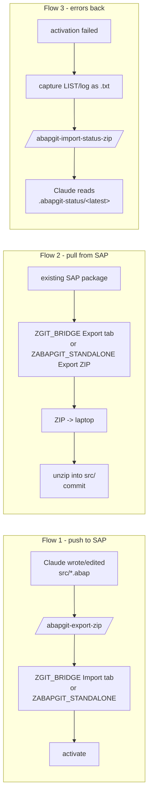

# abapgit-howto

Print quick how-to for the human in the loop. Three flows are covered:

1. **Push code Claude wrote → SAP** (the common case after `/abapgit-export-zip`)
2. **Pull existing SAP objects → ZIP for Claude** (so Claude can edit code that already exists in SAP)
3. **Send errors back to Claude** when activation fails



Output starts here. Paste verbatim to the user.

---

# abapGit offline — quick how-to

You have two SAP-side options. Pick once per system, stick with it.

| Reader | Best for | UI |
|---|---|---|
| **`ZGIT_BRIDGE`** | Multi-package work, single ZIP across any number of packages | Tabbed selection screen (Export / Import), F8 |
| **`ZABAPGIT_STANDALONE`** | Vanilla abapGit UX, single-package per repo | Full abapGit HTML GUI |

The flows below show the `ZGIT_BRIDGE` path first (recommended). Vanilla `ZABAPGIT_STANDALONE` instructions follow at the bottom.

---

## Flow 1A — Push code from Claude to SAP via `ZGIT_BRIDGE`

1. On your laptop, run `/abapgit-export-zip` → produces `dist/<repo>-<sha>.zip`.
2. Move the ZIP to your SAPGUI workstation.
3. SE38 → **`ZGIT_BRIDGE`** → F8 → click the **Import** tab.
4. Fill in:
   - **ZIP path:** the file from step 2.
   - **Transport:** any modifiable TR you own (or leave blank to be prompted).
   - **Activate:** ticked (default).
5. F8 to run.
6. Watch the LIST output — `IMPORT SUCCESS` means deserialise + activate both green. `IMPORT ACTIVATION_FAIL` or `IMPORT EXCEPTION` means see Flow 3.

> First run on a fresh client also auto-creates the `ZABAPGIT` metadata table — one-time, idempotent.

---

## Flow 1B — Push code from Claude to SAP via `ZABAPGIT_STANDALONE`

#### Setup once: create the offline repo

1. Run transaction **`ZABAPGIT`** (the full version).
2. Click **+ New Offline** (top toolbar).
3. Fill in:
   - **Name:** anything memorable.
   - **Package:** the SAP package you want this repo to mirror (e.g., `ZFOO` — auto-creates if missing).
   - **Folder logic:** `PREFIX` (default).
4. **Create Offline Repo** → it appears in the list.

> One offline repo = one SAP package. Want multiple packages? Create one offline repo per package, or switch to `ZGIT_BRIDGE` (Flow 1A).

#### Then per round

1. On your laptop, run `/abapgit-export-zip` → produces `dist/<repo>-<sha>.zip`.
2. Move the ZIP to your SAPGUI workstation.
3. **`ZABAPGIT`** → click into your offline repo → **Import ZIP** → upload.
4. **Stage all → Commit** (any message; local-only).
5. **SE80** → find any objects with yellow triangles → **Activate**.

Done. If errors → see Flow 3 below.

---

## Flow 2 — Pull existing SAP objects into a ZIP for Claude

### Via `ZGIT_BRIDGE`

When you want Claude to edit code that's already in SAP:

1. SE38 → **`ZGIT_BRIDGE`** → F8 → Export tab.
2. **Package to enumerate:** type the SAP package name → click the **PICK** button.
3. Tick the objects you want → F3 to confirm.
4. Repeat steps 2–3 for any other packages you want in the same ZIP.
5. **Output ZIP path:** pick a workstation file path.
6. F8 → ZIP written. Move back to your laptop.

### Via `ZABAPGIT_STANDALONE`

1. **`ZABAPGIT`** → click into your offline repo.
2. abapGit auto-detects all objects in the linked package.
3. Top toolbar → **Stage** (or just look at the file list — anything in the package shows up).
4. Top toolbar → **Export ZIP** *(or click **ZIP** icon)*.
5. SAPGUI saves the ZIP locally.
6. Move the ZIP back to your laptop.

Then on your laptop, in your project root:

```bash
unzip -o ~/from-sap.zip -d .
git add src/ .abapgit.xml
git commit -m "import existing SAP package"
```

Now Claude can edit `src/*.abap` and use `/abapgit-export-zip` to send changes back.

### Want to add MORE objects to an existing offline repo?

The repo tracks **everything in its linked package**. To add objects:

- **Move them into that package** — SE80 → object → right-click → **Other Functions → Change Package** → pick the repo's package
- They'll automatically appear in the repo's Stage view next time you open it
- Re-export ZIP, give to Claude

To split a large package across multiple repos: create multiple offline repos in abapGit, each pointed at a different sub-package, and use `Folder logic: PREFIX` so abapGit puts each in its own subfolder.

---

## Flow 3 — Send activation errors back to Claude

### From `ZGIT_BRIDGE`

When the LIST output shows `ACTIVATION_FAIL` or `EXCEPTION`:

1. The repo log is already on screen (`[E] ... [W] ...` lines after `--- abapGit log ---`).
2. **List → Save → Local File** as `.txt` — or just select-and-copy the LIST.
3. Carry the `.txt` back to the laptop.
4. ```bash
   /abapgit-import-status-zip ~/errors.txt --label round1
   ```
5. Tell Claude: *"errors imported under round1, please read .abapgit-status/ and fix."*

### From `ZABAPGIT_STANDALONE` / SE80

1. SE80 shows the error inline. **Ctrl+A → Ctrl+C** in the error panel.
2. Paste into a `.txt` file on your laptop (e.g., `errors.txt`).
3. Run on the laptop:
   ```bash
   /abapgit-import-status-zip ~/errors.txt --label round1
   ```
4. Tell Claude: *"errors imported under round1, please read .abapgit-status/ and fix."*

That's it. No special export needed — copy/paste is fine.

> Bigger error log? Save SE80 list via **List → Save → Local File** as `.txt`. Or export the whole abapGit repo state as a ZIP (top toolbar → **ZIP**) and `/abapgit-import-status-zip <that-zip>`.

---

## Troubleshooting

| Symptom | Fix |
|---|---|
| `ZGIT_BRIDGE` LIST: `WARN: not in TADIR, skipping` | The picked object isn't in the active TADIR yet (newly created on the SAP side, never saved). Save/activate it once on SAP, re-pick. |
| `ZGIT_BRIDGE` dump: `SAPSQL_PARSE_ERROR ... ZABAPGIT is not declared` | The metadata table wasn't bootstrapped. v1.2.0+ auto-creates it on first run; if you're on an older bridge build, regenerate from `tests/.test-fixtures/zgit_bridge_splice.py` and re-paste. |
| Standalone "Import ZIP" button greyed out | You're on the Repository List page, not inside the repo. Click into the repo first. |
| "Folder logic mismatch" warning (standalone) | The `.abapgit.xml` in your ZIP and the repo settings disagree. Recreate the offline repo with the same folder logic, OR edit `.abapgit.xml` to match. |
| "Object Z* exists in different package" | The object lives in another package on SAP. Either move it (SE80 → Change Package) or rename it to a name that doesn't exist. |
| "Cannot save: source has errors" | The error log IS the feedback you want — copy/paste and send to Claude (Flow 3). |
| Activation works for some objects, others stay yellow | Activate again — type cross-references resolve on second pass. Or use Eclipse ADT's *Activate Inactive Objects*. |
