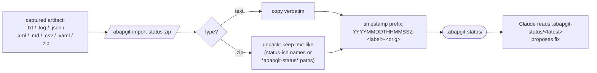

# /abapgit-import-status-zip

Closes the manual cycle. After you imported the export ZIP into abapGit, activated objects in SE80, and saw what happened — bring the result back to Claude.



## Usage

```
/abapgit-import-status-zip ~/from-sap-errors.txt
/abapgit-import-status-zip ~/abapgit-export.zip
/abapgit-import-status-zip ~/errors.txt --label fix-attempt-1
/abapgit-import-status-zip ~/errors.txt --dry-run
```

## What it accepts

| Input | What happens |
|---|---|
| `.txt` / `.log` | Copied verbatim into `.abapgit-status/<timestamp>-<filename>` |
| `.json` | Copied verbatim |
| `.xml` / `.md` / `.csv` / `.yaml` | Copied verbatim |
| `.zip` | Unpacked: text-like files (with status-ish names or under `*abapgit-status*` paths) extracted into `.abapgit-status/` |

The script timestamps every imported file so you can keep multiple iterations side-by-side.

## What you typically capture from SAPGUI

| Source | How to capture |
|---|---|
| **SE80 activation error log** | Right-click error in dropdown → Copy → paste into `errors.txt` |
| **SE38/SE24 syntax check** | `Program → Check → Syntax` → save error list as text |
| **SE91 message class issues** | Copy log content from result panel |
| **abapGit's import log** | Click "Log" on the abapGit repo view → "Save" |
| **ATC results** (optional) | Run ATC → Export to file |

If you only have a screenshot, save the OCR'd text as a `.txt`. Or just copy/paste the error into your shell:

```bash
cat > ~/errors.txt <<'EOF'
ZCL_DEMO line 12: Type "ZAI_T_FOO" is unknown
ZCL_DEMO line 18: Method "BAR" not found
EOF
/abapgit-import-status-zip ~/errors.txt --label run1
```

## Safety

- **Never overwrites `src/`.** Source-of-truth stays on your laptop in Git. ZIP contents under `src/` are explicitly skipped.
- Existing files are skipped unless `--force`.
- No schema validation — Claude reads loosely.

## Typical manual cycle

```mermaid
sequenceDiagram
    participant Dev as Developer + Claude
    participant Disk as Laptop disk
    participant SAP as SAPGUI / SAP

    Dev->>Disk: edit ABAP
    Dev->>Disk: /abapgit-export-zip
    Disk-->>SAP: ZIP
    SAP->>SAP: Import ZIP, activate
    SAP-->>Dev: errors as .txt
    Dev->>Disk: /abapgit-import-status-zip
    Disk-->>Disk: .abapgit-status/&lt;ts&gt;-...
    Dev->>Dev: read latest, propose fix
    Note over Dev,SAP: loop until green
```

## Under the hood

Runs `skills/abapgit-import-status-zip/scripts/abapgit_import_status_zip.py`.

## Related
- `/abapgit-export-zip` — pack source for SAPGUI
- `skills/abapgit-workflow/SKILL.md` — full manual-cycle guide
