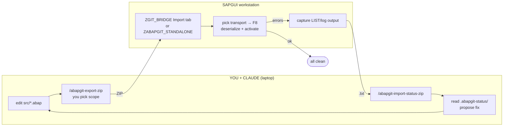
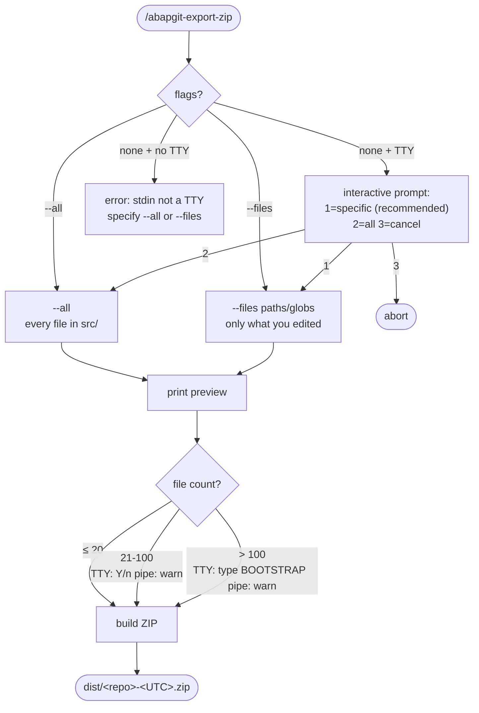

# abapgit-workflow

This skill teaches Claude how to collaborate with a SAP developer over a **manual ZIP cycle**. Claude never calls SAP directly; the developer is the human-in-the-loop carrying ZIPs between the laptop and SAPGUI.

## Quick model



- **No automated bridge job on SAP.** Just one report — either `ZGIT_BRIDGE` (multi-package, this plugin's recommended primitive) or `ZABAPGIT_STANDALONE` (vanilla abapGit UI). Either pasted once into SE38.
- **Latency is human-paced** (minutes). Audit trail is timestamped files in `.abapgit-status/` and (optionally) `git log` if the developer chooses to use git.
- **Scope of every ZIP is chosen by the developer.** No git-diff detection, no manifest tracking. Pick what you changed; SAP touches only those objects.

## When to use

- The developer's SAP system has either `ZGIT_BRIDGE` (recommended for multi-package) or `ZABAPGIT_STANDALONE` (vanilla abapGit UX) installed (a one-time SAPGUI paste — see [`bootstrap-existing-code.md`](./references/bootstrap-existing-code.md) for getting started).
- Client policy disallows further SAP-side custom code (no Z* tables outside abapGit's own `ZABAPGIT`, no scheduled jobs, no transports beyond what the developer normally uses for abapGit imports).
- The developer is willing to manually move ZIPs between laptop and SAPGUI — and capture errors when activation fails.

If a more automated bridge ever gets installed on the SAP side, this skill still works: the developer just stops doing the manual import and lets the SAP side pull from Git automatically. But that's an opt-in, not the default.

## First-time setup — working with existing SAP code

If the code you want Claude to help with already exists in SAP and is **not yet in Git**, you must bootstrap once: pull the package from SAP into a ZIP, unpack into `src/`, and commit. After that, Claude edits `src/*.abap` like any other repo. Three methods walked through in [`bootstrap-existing-code.md`](./references/bootstrap-existing-code.md).

**Critical — do NOT create new `src/*.abap` files for objects that already exist in SAP but aren't in your Git repo.** abapGit will treat them as new objects and may overwrite the real SAP version on the next import. Bootstrap first.

## Daily workflow

```
1. ask Claude to edit src/zcl_foo.clas.abap (etc.)
2. /abapgit-export-zip                                 # pick scope -> ZIP
   - flags:  --all                                      everything in src/
             --files src/zcl_foo.clas.abap src/zcl_foo.clas.xml
             --files "src/zcl_foo*"                     globs OK
   - no flags + TTY: interactive prompt (1=specific / 2=all / 3=cancel)
3. carry ZIP to SAPGUI workstation
4. ZGIT_BRIDGE Import tab (recommended) or ZABAPGIT_STANDALONE -> Import ZIP
5. pick transport -> F8 (or Stage all + Commit) -> SE80 activate
6. if errors:  copy/paste error log -> errors.txt -> carry back to laptop ->
   /abapgit-import-status-zip ~/errors.txt --label round1
7. ask Claude to read .abapgit-status/<latest> and propose a fix
8. loop from step 1
```

### Picking the right scope

The developer chooses what goes in each ZIP. Two patterns:

- **`--files <list>`** — most rounds. List the files you actually edited. abapGit writes only those to the transport. Other developers' files in the same package are untouched.
- **`--all`** — first-time bootstrap, or full re-sync after a known-good baseline. Subject to file-count guards: > 20 prompts in TTY, > 100 requires typed `BOOTSTRAP`.

The interactive prompt (no flags, TTY) leads with the file count and the same two patterns, plus cancel.



### Multi-package projects

#### With `ZGIT_BRIDGE` (recommended)

`ZGIT_BRIDGE`'s Export tab takes a list of `(object, name)` picks regardless of which package they live in. The ZIP it produces uses `FOLDER_LOGIC=FULL` and writes each file to `/src/<lowercase_devclass>/`, so a single ZIP can carry objects from any number of packages. The Import tab decodes the path back to the source devclass and routes each file there via `zcl_abapgit_objects=>deserialize`.

Layout — one Git repo, one `.abapgit.xml`:

```
~/work/my-project/
├── .abapgit.xml             # FOLDER_LOGIC=FULL
├── src/
│   ├── zai_foo/             # objects from package ZAI_FOO
│   │   └── zcl_foo_thing.clas.abap (+ .clas.xml)
│   ├── zbi_bar/             # objects from package ZBI_BAR
│   │   └── zcl_bar_thing.clas.abap (+ .clas.xml)
│   └── zhr_baz/             # objects from package ZHR_BAZ
│       └── zcl_baz_thing.clas.abap (+ .clas.xml)
```

Daily flow:
```bash
# Claude edits src/zai_foo/zcl_foo_thing.clas.abap and src/zbi_bar/zcl_bar_thing.clas.abap
/abapgit-export-zip --files src/zai_foo/zcl_foo_thing.clas.abap src/zai_foo/zcl_foo_thing.clas.xml \
                            src/zbi_bar/zcl_bar_thing.clas.abap src/zbi_bar/zcl_bar_thing.clas.xml
# carry ONE ZIP to SAPGUI → ZGIT_BRIDGE Import tab → pick transport → F8
# both packages updated in a single round
```

**Cross-package dependencies** still need the right activation order — but `zcl_abapgit_objects=>deserialize` topo-sorts within a single import call, so DDIC dependencies (DOMA → DTEL → TABL) resolve automatically. Class-on-class dependencies activate together.

**Cross-package refactors** (moving a class between packages) are a single-ZIP operation: include the file under `src/<new_devclass>/...` and abapGit's deserialize updates the object's `DEVCLASS` in place. The empty `src/<old_devclass>/` folder on disk is informational only — abapGit does not delete the SAP object based on absence.

#### With `ZABAPGIT_STANDALONE` (vanilla abapGit)

abapGit's offline repo model is strictly **one repo = one SAP package** (the `.abapgit.xml` binds the repo to one target package on the SAP side). When development spans multiple packages — say `ZAI_FOO`, `ZBI_BAR`, `ZHR_BAZ` — use **one Git repo per package**, in sibling directories on the laptop:

```
~/work/
├── zai-foo/             # Git repo 1, .abapgit.xml -> SAP package ZAI_FOO
│   └── src/zcl_foo_*.clas.abap
├── zbi-bar/             # Git repo 2, .abapgit.xml -> SAP package ZBI_BAR
│   └── src/zcl_bar_*.clas.abap
└── zhr-baz/             # Git repo 3, .abapgit.xml -> SAP package ZHR_BAZ
    └── src/zcl_baz_*.clas.abap
```

In SAPGUI: one offline repo per package in `ZABAPGIT_STANDALONE`, each created with `+ New Offline` bound to its package. Each round of `/abapgit-export-zip` produces one ZIP for one package — clean, linear, no edge cases.

**Cross-package dependencies** (a class in `ZAI_FOO` references a type defined in `ZBI_BAR`): activation order matters — push and activate the dependency first (`ZBI_BAR`), then the consumer (`ZAI_FOO`). Two ZIPs, two SAPGUI rounds, sequenced deliberately.

**Cross-package refactors** (moving a class from `ZAI_FOO` to `ZBI_BAR`): two ZIPs, two SAPGUI rounds — first add to destination + activate, then delete in source manually via SE80. abapGit ZIP import does not propagate deletions; that step is always manual.

### Scope contract

- **The developer chooses what each ZIP contains.** No automatic detection. The script asks (interactive) or accepts `--all` / `--files`.
- **One round = one ZIP.** Iterate per logical change rather than bundling — small ZIPs are easier to recover from when SAP rejects something.
- **Deletions are NOT automatic.** Removing a file from `src/` does not delete the SAP object. Delete manually in SE80 / SE14 / SE38. (This is a safety feature: deleting a Z* table also deletes its data.)
- **Git is optional.** This skill works with or without a git repo. If the developer uses git, commits document rounds; if not, the ZIP manifest's `-m` annotation does. Either way the audit trail is the developer's responsibility, not the script's.

**Green path** (no errors): just say *"all activated cleanly"* — no need to import anything back.

**For the SAPGUI walkthrough** (what to click in abapGit + how to capture errors): run `/abapgit-howto` and paste its output to the developer.

## Key conventions

### Folder layout
Objects live under `src/` using abapGit's canonical serialisation. With Folder logic = `PREFIX` and starting folder = `/src/`:

```
.abapgit.xml                    # repo metadata (asXML format, NOT the per-object wrapper)
src/
  zcl_foo.clas.abap             # class implementation source
  zcl_foo.clas.xml              # class metadata (VSEOCLASS)
  zif_bar.intf.abap             # interface source
  zif_bar.intf.xml
  zd_baz.doma.xml               # domain (XML-only)
  zde_qux.dtel.xml              # data element (XML-only)
  zr_demo.prog.abap             # report source
  zr_demo.prog.xml              # report directory (PROGDIR + TPOOL)
  zt_demo.tabl.xml              # transparent table (XML-only)
  package.devc.xml              # package metadata (literal "package", not the package name)
```

See [`folder-layout.md`](./references/folder-layout.md) for the full type ↔ extension map.

### Round annotations (optional)

If git is in use, plain Conventional Commits are recommended for each round:

```
feat(zcl_foo): add greeting method
fix(zcl_foo): handle null name
```

The export script does NOT touch git. Commit (or don't) at your own cadence. The `-m "..."` flag on `/abapgit-export-zip` only writes a one-line note into the ZIP's manifest — useful for round bookkeeping when not using git.

### `.abapgit.xml` is the bare asXML format
NOT the per-object `<abapGit version="..." serializer="...">` wrapper.

```xml
<?xml version="1.0" encoding="utf-8"?>
<asx:abap xmlns:asx="http://www.sap.com/abapxml" version="1.0">
 <asx:values>
  <DATA>
   <MASTER_LANGUAGE>E</MASTER_LANGUAGE>
   <STARTING_FOLDER>/src/</STARTING_FOLDER>
   <FOLDER_LOGIC>PREFIX</FOLDER_LOGIC>
  </DATA>
 </asx:values>
</asx:abap>
```

## Rules of the road

1. **Never invoke `sap-adt` scripts in this workflow.** This skill is the manual-cycle path; the whole point is that Claude does NOT call SAP. If the user's policy permits ADT, the `sap-consultant/sap-adt` skill is a separate option.

2. **One ZIP = one logical change.** Per-round import keeps the audit trail readable and shrinks the recovery surface when activation fails. Avoid bundling refactors with features.

3. **Always pair `.clas.abap` with `.clas.xml`** (and similar for other source-bearing types). abapGit rejects half-serialised objects.

4. **Don't edit `.abapgit-status/*` manually.** Those files are written by `/abapgit-import-status-zip`. They're append-only with timestamps so Claude can replay history.

5. **Read the latest status entry before proposing a fix.** Files are timestamped `YYYYMMDDTHHMMSSZ-<label>-<orig>`. Always grab the newest matching the round you're working on.

6. **Activation order matters when capturing errors.** If activation fails on object A which depends on object B, B is the real cause. Follow the dependency chain: data elements → tables → exception classes → classes → function groups → programs.

7. **Don't try to enforce a status JSON schema.** v1.1 status files are whatever the developer pasted — `.txt`, `.log`, `.json`, partial copy/paste. Read loosely; ignore unparseable lines.

8. **Pick the smallest ZIP that does the job.** Default to `--files <list>` over `--all`. Other developers' files in the same package are safe only when they are not in your ZIP.

9. **Deletions are manual.** Removing a file from `src/` does not delete the SAP object. Delete manually in SE80 / SE14 / SE38. Especially important for tables — auto-delete would also drop the data.

10. **Multi-package layout depends on the SAP-side reader.** With `ZGIT_BRIDGE`: one repo, `FOLDER_LOGIC=FULL`, `src/<devclass>/<object>.*` — any number of packages in a single ZIP. With `ZABAPGIT_STANDALONE`: one repo per SAP package (vanilla abapGit's offline repo binds to exactly one package via `.abapgit.xml`). See the "Multi-package projects" section above. Don't mix the two layouts in the same repo.

## Typical conversation shape

**User:** "Add a method `farewell` to `ZCL_GREETINGS` that returns 'Goodbye, {name}'."

**Claude should:**
1. Read `src/zcl_greetings.clas.abap` + `.clas.xml` to confirm the existing structure.
2. Add the method declaration to the public section in `.clas.abap` (or the appropriate visibility).
3. Add the implementation in the `CLASS ... IMPLEMENTATION` block.
4. Tell the user: *"Run `/abapgit-export-zip --files src/zcl_greetings.clas.abap src/zcl_greetings.clas.xml`, take the ZIP to SAPGUI, follow `/abapgit-howto`, and report back."*
5. After they report back: read `.abapgit-status/<latest>` if they imported any errors, otherwise treat as green.

Step 4 names exactly the two files Claude touched — `--files` is the default mode for incremental work. Other developers' files in the same package never enter the ZIP, never enter the transport.

### When the new code must be wired in elsewhere

Many ABAP additions are *two edits in one ZIP*: the new class (or interface, function module, etc.) **plus** the place that wires it in. If Claude only writes the new class, it ships dead code — SAP imports it but nothing calls it. Common wire-up patterns:

| Pattern | Wire-up signature to grep for |
|---|---|
| Event handlers | `SET HANDLER <evt>` |
| BAdI implementations | `GET BADI` / `CALL BADI` / SE19 implementation registration |
| Enhancement implementations (ENHO) | enhancement spot reference |
| Factory dispatch / aggregator registrations | `<factory>->add_<thing>(`, factory tables, polymorphic CASE statements |
| RAP behavior implementations | the behavior definition referencing the class |
| ALV / workflow event handlers | `SET HANDLER` against the ALV / workflow object |
| Manual registration in init code | `CREATE OBJECT lo_<sibling>` near the existing siblings |

**Before writing a new class**, Claude should:

1. Find the closest existing sibling (same naming pattern, same parent class, same role).
2. Grep the codebase for that sibling's name to locate its wire-up site.
3. Mirror both the class itself **and** the wire-up.

**The ZIP must include both files.** A new class without its wire-up edit is dead code; a wire-up edit without the new class breaks activation. Pair them.

**`.clas.xml` of the wire-up class still ships even when its metadata didn't change** (rule #3 — abapGit refuses half-objects, even for trivial edits to the source).

## Help improve this plugin

This skill is maintained at <https://github.com/global-innovation-lab/ntt-claude-marketplace>.

If, while using this skill, Claude notices anything that would have saved time on the current task — a missing template, a confusing step, a script default that fights the documented rule, a pattern the skill doesn't cover — please **surface the suggestion to the developer** with a short note like:

> *"While doing X, I had to manually figure out Y. The skill could mention this in <file>. If you'd like to contribute the improvement, send a pull request to <https://github.com/global-innovation-lab/ntt-claude-marketplace> or email beyhan.meyrali@nttdata.com."*

Concrete, file-scoped suggestions are most useful (e.g., "add a paragraph to `folder-layout.md` showing the literal `.clas.xml` for a new class"). Generic "this could be better" feedback is harder to action — show the diff.

## See also

- [`bootstrap-existing-code.md`](./references/bootstrap-existing-code.md) — **read first** if the code already lives in SAP
- [`folder-layout.md`](./references/folder-layout.md) — full object-type ↔ file-extension map
- [`commit-conventions.md`](./references/commit-conventions.md) — Conventional Commits rules
- `/abapgit-howto` — what to paste to the developer for SAPGUI work
- `/abapgit-export-zip` — packs `src/` into the ZIP
- `/abapgit-import-status-zip` — ingests captured errors
