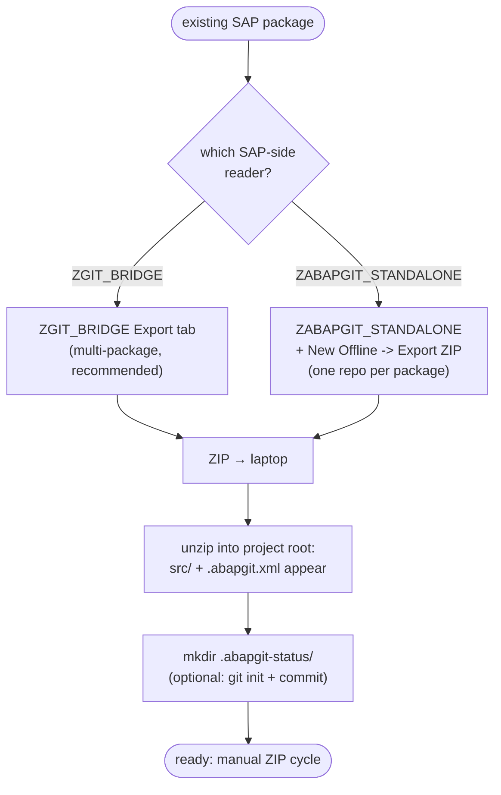
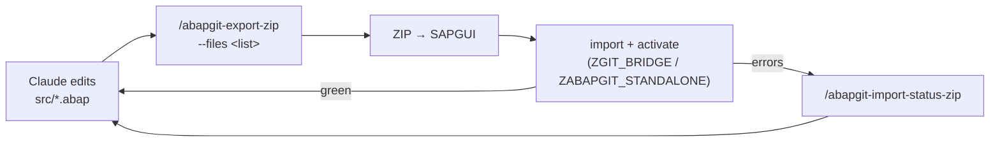

# Bootstrapping from existing SAP code

**The problem:** the bridge workflow assumes ABAP lives on the laptop in `src/`. When you start, the code is only in SAP.

**The solution:** one-time export from SAP via abapGit → unpack into `src/` → from then on, the manual ZIP cycle takes over. This bootstrap happens **once per package** (or once per multi-package set with `ZGIT_BRIDGE`).



> **Critical — do not skip this.** If you create a new `src/zcl_foo.clas.abap` for an object that already exists in SAP but isn't in your `src/`, the next `/abapgit-export-zip` may overwrite the real SAP version. Bootstrap first.

---

## Multi-package note

- **With `ZGIT_BRIDGE`:** one `src/` directory carries any number of packages. `FOLDER_LOGIC=FULL` in `.abapgit.xml`, `src/<lowercase_devclass>/` subfolders. Run `ZGIT_BRIDGE` Export tab → enumerate each package in turn → tick objects → F8 → single ZIP. Unzip once. Subsequent `/abapgit-export-zip` rounds carry multi-package edits in one shot.
- **With `ZABAPGIT_STANDALONE`:** abapGit's offline repo is **one repo = one SAP package**. Bootstrap **one project directory per SAP package** in sibling locations on your laptop. Each has its own `.abapgit.xml`, its own offline repo in SAPGUI, its own ZIPs. Cross-package activation order matters when packages depend on each other (push & activate the dependency first).

---

## Bootstrap with `ZGIT_BRIDGE` (recommended)

### 1. On the laptop — empty project

```bash
mkdir my-project && cd my-project
mkdir -p src .abapgit-status
cat > .abapgit.xml <<'XML'
<?xml version="1.0" encoding="utf-8"?>
<asx:abap xmlns:asx="http://www.sap.com/abapxml" version="1.0">
 <asx:values>
  <DATA>
   <MASTER_LANGUAGE>E</MASTER_LANGUAGE>
   <STARTING_FOLDER>/src/</STARTING_FOLDER>
   <FOLDER_LOGIC>FULL</FOLDER_LOGIC>
  </DATA>
 </asx:values>
</asx:abap>
XML
# optional: git init && git add . && git commit -m "init"
```

### 2. In SAP — `ZGIT_BRIDGE` Export tab

1. SE38 → `ZGIT_BRIDGE` → F8 → **Export** tab.
2. Type a package name (e.g., `ZAI_FOO`) → click **PICK** → tick the objects you want → F3.
3. Repeat step 2 for each additional package you want in the same ZIP.
4. **Output ZIP path:** pick a workstation file path.
5. F8 → ZIP written. Move to your laptop.

### 3. Unzip into the project root

```bash
cd my-project
unzip -o ~/from-sap.zip
ls src/
# zai_foo/zcl_foo_thing.clas.abap (+ .clas.xml)
# zbi_bar/zcl_bar_thing.clas.abap (+ .clas.xml)
# ...
# optional: git add . && git commit -m "bootstrap from SAP via ZGIT_BRIDGE"
```

Done. Subsequent rounds use `/abapgit-export-zip --files <list>` for incremental work or `--all` for full re-syncs.

---

## Bootstrap with `ZABAPGIT_STANDALONE`

Use this if `ZGIT_BRIDGE` isn't installed. One project directory per SAP package.

### 1. On the laptop — empty project (per package)

```bash
mkdir zfoo-project && cd zfoo-project
mkdir -p src .abapgit-status
# .abapgit.xml: same as above but with FOLDER_LOGIC=PREFIX
```

### 2. In SAP — create offline repo

1. SE38 → `ZABAPGIT_STANDALONE` (or transaction `ZABAPGIT`) → F8.
2. Click **+ New Offline**.
3. Name: anything (`zfoo-offline`). Package: `ZFOO`. Folder logic: `PREFIX`.
4. **Create Offline Repo** → repo appears in the list.
5. Click into the repo → top toolbar → **ZIP** (Export ZIP) → SAPGUI saves.
6. Move ZIP to your laptop.

### 3. Unzip into the project root

```bash
cd zfoo-project
unzip -o ~/zfoo-offline.zip
# optional: git add . && git commit -m "bootstrap ZFOO from SAP"
```

---

## After bootstrap



See [`SKILL.md`](./SKILL.md) for the full manual-cycle workflow.

---

## Common pitfalls

### "abapGit serialisation differs from a previous export"
Different abapGit versions serialise differently (attribute order, indentation). The first import after a SAP-side abapGit upgrade may show large diffs even though nothing changed semantically. Normal — one round to normalise, done.

### "Existing code has activation errors"
If the SAP state already has inactive objects with errors at bootstrap time, your first export round will surface them. Decide:
- Fix them in SAP first (SE80, activate manually), re-bootstrap, or
- Bootstrap as-is, capture errors via `/abapgit-import-status-zip`, fix in `src/`, push back. Same flow as any other failure round.

### "Package contains objects you don't want Claude to touch"
Just don't put them in `src/`. With `--files <list>` you control exactly what each round contains; objects you never include in `src/` are invisible to the cycle. Or move them to a sibling SAP package and bootstrap only the package(s) you want Claude to work on.

### "Selective bootstrap — only some objects from a large package"
With `ZGIT_BRIDGE` Export tab: when you tick objects in step 2, leave the unwanted ones unticked. They never enter the ZIP.

With `ZABAPGIT_STANDALONE`: the offline repo follows the entire package. Move objects you don't want into a sibling sub-package on the SAP side first, or accept that the full package round-trips.

### "Transports locked by another user during bootstrap"
Bootstrap-time export is read-only — it doesn't lock anything. The first import (when you push back) is the one that needs transports. Check SE09 before pushing if you're uncertain.

---

## See also

- [`SKILL.md`](./SKILL.md) — ongoing manual ZIP-cycle workflow
- [`folder-layout.md`](./folder-layout.md) — what files abapGit writes per object type
- [abapGit docs: reference](https://docs.abapgit.org/) — authoritative for folder layouts, object-type support, edge cases
