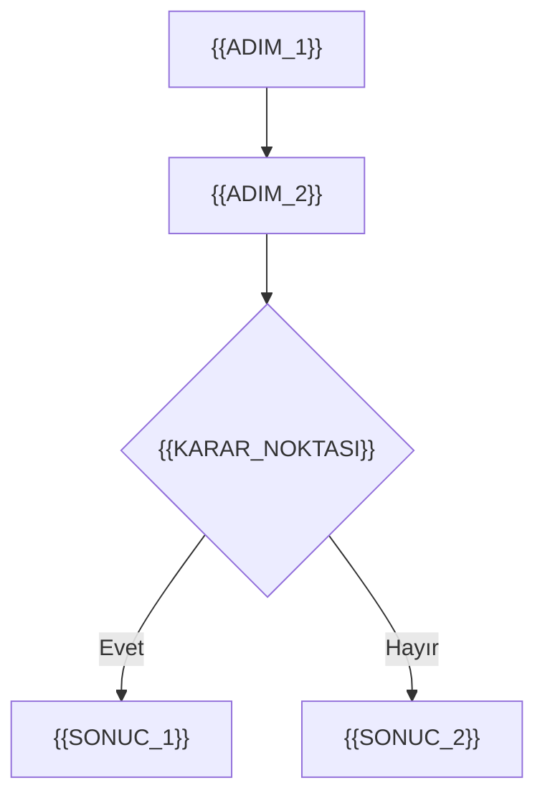

<!--
  ŞABLON KULLANIMI:
  - {{...}} alanlarını doldurun, hiçbirini boş bırakmayın.
  - Bölüm sırasını ve başlıklarını korumak zorunludur (PDF stili buna göre tasarlandı).
  - <!-- yorum --> satırları yazım talimatıdır; nihai dokümanda silinir.
  - Görsel dosya adları capture/annotate adımının ürettiği adlarla eşleşmeli.
  - title: analiz/metadata üzerinden bulunan GERÇEK fonksiyonel iş/program adı olmalı
    (örn. "Ertelenmiş Vergi Raporu"). Asla sabit "SAP Kullanıcı Dokümanı" yazma ve
    başlığın içine tekrar "Kullanıcı Dokümanı" ekleme — bunu subtitle zaten taşır.
    Gerçek bir iş adı hiçbir kaynaktan bulunamazsa işlem kodunu ({{ISLEM_KODU}}) yaz.
  - Bu frontmatter bloğu (title/subtitle/customer/version/date/system/transaction/
    variant/author) render.js tarafından ayrıştırılır ve yalnızca kapaktaki iki
    sütunlu kurumsal bilgi tablosunda ile üst/alt bilgi şablonunda gösterilir; bu
    bloğu asla gövde metninde tekrar yazma (İçindekiler'e girer / ham metin olarak
    görünür).
  - Departman, kullanım sıklığı, tam iş amacı, destek kişisi, iş kuralı gibi bilgiler
    güvenilir bir kaynaktan doğrulanamıyorsa ilgili cümleyi/satırı/alanı TAMAMEN ATLA;
    "doğrulanamadı", "teyit edilmesi önerilir", "danışmanla kontrol edilmelidir",
    "bilgi paylaşılmamıştır" gibi hiçbir açıklama/uyarı/not/placeholder yazma.
-->

---
title: "{{PROGRAM_BASLIGI}}"
subtitle: "Kullanıcı Dokümanı"
customer: "{{MUSTERI_ADI}}"
version: "1.0"
date: "{{TARIH}}"
system: "{{SISTEM_ID}}"
transaction: "{{ISLEM_KODU}}"
variant: "{{VARYANT}}"
author: "{{HAZIRLAYAN}}"
---

# Genel Bakış

<!-- 3-5 cümle. İş problemi + programın çözümü + kimin kullandığı. Danışman görüşmesinden gelir, koddan değil. -->
{{GENEL_BAKIS}}

> [!NOT]
> Bu dokümandaki ekran görüntüleri SAP web arayüzünden alınmıştır. Masaüstü SAP GUI kullanıyorsanız ekran görünümünde küçük farklılıklar olabilir; alanlar ve adımlar aynıdır.

# Süreç Akışı

<!-- Tek Mermaid flowchart, kullanıcının gözünden, en fazla ~10 kutu. Kod akışı DEĞİL, iş akışı. -->

# Başlamadan Önce

<!-- Yetki rolleri (AUTHORITY-CHECK'ten türetilip görüşmede doğrulanır), ön koşullar, gerekli veriler. -->

| Gereksinim | Açıklama |
|---|---|
| Yetki | {{YETKI_ACIKLAMASI}} |
| {{ON_KOSUL_1}} | {{ON_KOSUL_1_ACIKLAMA}} |

# Hangi Kayıtlar Bu Ekranda Görünür?

<!-- İşlem/iş listesi ekranları için zorunlu, düz raporlarda bu bölümü silin.
     Programa gömülü, kullanıcının kontrol edemediği filtreleri (statü koşulu, sipariş tipi,
     içerik kuralları) açıkça yazın. "Kaydım listede yok" destek çağrılarının ana sebebi budur. -->

{{GORUNURLUK_KURALI}}

> [!NOT]
> {{GORUNMEYEN_KAYIT_ACIKLAMASI}}
<!-- Örn: "Statüsü henüz 'Ürünler Hazırlanıyor' olmayan siparişler bu listede görünmez;
     sipariş göremiyorsanız önce statüsünü kontrol edin." -->

# Adım Adım Kullanım

<!-- Her adım: numara + tek eylem + gerekiyorsa ekran görüntüsü. Görseldeki numaralı işaretler metindeki numaralarla birebir eşleşir. -->

## 1. Programı açın

{{ISLEM_KODU}} işlem kodunu girerek programı açın.

## 2. Seçim alanlarını doldurun

<!-- Alanları iki grupta düşünün ve ayrımı görünür kılın:
     (a) FİLTRE: listeyi/sonucu daraltır (sipariş no, tarih, müşteri...).
     (b) DAVRANIŞ: programın ne yapacağını değiştirir (test/güncelleme modu, arka plan seçeneği...).
     Filtreler tabloya girer; davranış değiştiren her seçenek tablodan sonra ayrı bir
     [!DIKKAT] kutusuyla açıklanır — kullanıcı "hangi kutucuk veri değiştirir" sorusunun
     cevabını tabloda aramamalı, kutuda görmeli. Davranış parametresi yoksa kutuyu silin. -->

| # | Alan | Zorunlu | Ne girmelisiniz | Örnek |
|---|---|---|---|---|
| ① | {{ALAN_1}} | Evet | {{ALAN_1_ACIKLAMA}} | {{ALAN_1_ORNEK}} |
| ② | {{ALAN_2}} | Hayır | {{ALAN_2_ACIKLAMA}} | {{ALAN_2_ORNEK}} |

> [!DIKKAT]
> {{DAVRANIS_PARAMETRESI_ACIKLAMASI}}
<!-- Örn: "'Test modu' kutusu işaretliyken hiçbir veri değişmez; kutuyu kaldırıp
     çalıştırdığınızda kayıtlar gerçekten güncellenir." -->

> [!IPUCU]
> {{IPUCU_METNI}}

## 3. Programı çalıştırın

<!-- Devam eden adımlar... -->

# Ekrandaki İşlemler

<!-- İşlem ekranları için zorunlu, salt görüntüleme raporlarında silin.
     Her buton için: ne yapar, ön koşulu ne, geri alınabilir mi. Ekrandaki HİÇBİR butonu
     atlamayın — açıklanmamış buton, "buna basarsam ne olur?" korkusu demektir.
     Geri alınamaz işlemler (iptal, faturalamaya gönderme, silme) ayrıca [!DIKKAT] alır. -->

| Buton | Ne yapar | Ön koşul | Geri alınabilir mi? |
|---|---|---|---|
| {{BUTON_1}} | {{BUTON_1_ISLEV}} | {{BUTON_1_KOSUL}} | {{EVET_HAYIR}} |

> [!DIKKAT]
> {{GERI_ALINAMAZ_ISLEM_UYARISI}}

# Sonuçların Yorumlanması

<!-- Çıktı ekranındaki kolonlar, renk/ikon/statü anlamları. ALV field catalog'dan türetilip görüşmede doğrulanır. -->

| Kolon | Anlamı |
|---|---|
| {{KOLON_1}} | {{KOLON_1_ACIKLAMA}} |

# Örnek Senaryolar

## Senaryo 1: {{SENARYO_1_BASLIK}}

<!-- Görüşmede kararlaştırılan happy-path. Buradaki değerler ekran görüntülerindeki değerlerle AYNI olmalı. -->

| Durum | Yaptığınız | Göreceğiniz sonuç |
|---|---|---|
| {{DURUM}} | {{EYLEM}} | {{SONUC}} |

## Senaryo 2: {{SENARYO_2_BASLIK}}

<!-- En sık karşılaşılan hata/kenar durum. -->

# Sık Karşılaşılan Mesajlar ve Çözümleri

<!-- MESSAGE analizinden türetilir; yalnızca kullanıcının gerçekten karşılaşabileceği mesajlar. Her satırda somut bir eylem olmalı. -->

| Mesaj | Anlamı | Ne yapmalısınız |
|---|---|---|
| "{{MESAJ_1}}" | {{MESAJ_1_ANLAM}} | {{MESAJ_1_COZUM}} |

# Sık Sorulan Sorular

**{{SORU_1}}**
{{CEVAP_1}}

<!-- Doküman burada biter. Ayrı bir "Destek" bölümü EKLEME: destek kanalı çoğu müşteride
     belirsizdir ve genel bir doküman için uydurma bir kanal yazmak yanıltıcıdır. Gerekli
     olduğunda destek yönlendirmesini "Başlamadan Önce" veya ilgili mesaj satırına tek cümle
     olarak koy (örn. "... SAP destek biriminize başvurun"). -->

