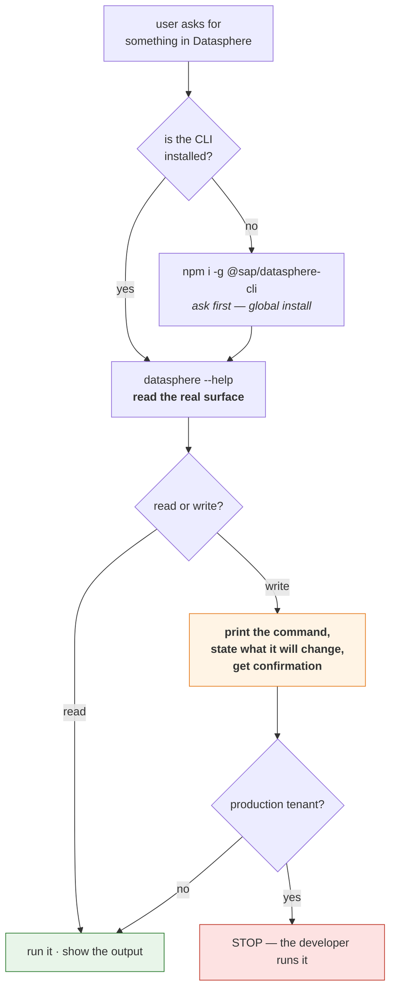

# SAP Datasphere — use SAP's official CLI

## The one rule

**Datasphere work goes through `@sap/datasphere-cli`, SAP's own published tool.**
Do not install, vendor or recommend a third-party Datasphere MCP server, and do not
hand-roll HTTP calls against Datasphere's APIs.

Why this is the rule and not a preference:

| | |
|---|---|
| **No official MCP server exists.** | Verified 2026-07-27 against the npm registry and the SAP GitHub org. SAP *does* ship official MCP servers (e.g. `@sap-ux/fiori-mcp-server`) — just not for Datasphere. Anything on npm claiming to be one is somebody's personal project. |
| **The CLI is the supported surface.** | `@sap/datasphere-cli` is published under SAP's own npm scope, tracks the tenant release train, and is the interface SAP documents and supports. |
| **It is proprietary.** | Licensed "SEE LICENSE IN LICENSE", not MIT. This marketplace's rule for non-free dependencies is *reference and guide, never vendor* — so this plugin tells you how to use the CLI, and bundles nothing. You install the CLI yourself, under SAP's licence. |
| **Third-party wrappers carry the risk without the support.** | `@mariodefe/sap-datasphere-mcp` and similar are personal-scope packages with no SAP relationship. If one breaks or misbehaves against a customer tenant, there is nobody to escalate to. |

If the user explicitly asks for a third-party Datasphere MCP server anyway: say plainly
that it is unofficial and unsupported, point at this skill, and let them decide. Do not
install one silently.

---

## Setup

Node **20–24** (the CLI declares that range; newer majors are not supported yet).

```bash
npm install -g @sap/datasphere-cli     # or: npx @sap/datasphere-cli <command>
datasphere --version
```

Authentication is OAuth against the tenant. In the Datasphere UI an administrator creates
an **OAuth client** (*System → Administration → App Integration*), which yields a client
id, a client secret, an authorization URL and a token URL. Log in once and the CLI caches a
refresh token:

```bash
datasphere login --help          # confirm the exact flags for your CLI version
```

For CI / non-interactive use, SAP supports passing a **secrets file** rather than flags, so
the client secret never lands in shell history or a process list. Prefer that.

> **Credentials are never committed.** A Datasphere secrets file belongs alongside
> `.conn_adt` and `.btp_service_key*.json` in the "plaintext credentials, never in git"
> category. Check `.gitignore` before writing one into a repo.

---

## Discover the command surface — do not guess it

The CLI's command tree changes with the tenant release train, so **read it from the tool**
rather than reciting a version you remember:

```bash
datasphere --help
datasphere <group> --help          # e.g. spaces, objects, tasks, dbusers, marketplace
datasphere <group> <command> --help
```

Broadly, the groups cover: **spaces** (list, read, create, update, delete, and the space
definition as a file), **objects** (local tables, views, data flows, replication flows —
read and deploy), **task chains** and task runs, **database users**, **marketplace** data
products, and **configuration/profiles** for switching tenants.

Print the help, then act on what it actually says. If a command you expected is missing,
the tenant or CLI version does not have it — say so instead of improvising an HTTP call.

---

## How to work



1. **Read before you write.** `spaces read` / `objects read` first, so you know the current
   definition. Datasphere deploys are whole-object; a partial payload overwrites.
2. **Definitions are files.** The CLI exchanges JSON/CSN definitions. Keep them in the repo,
   diff them, review them — this is the same file-first doctrine the rest of this
   marketplace runs on, and it works well here.
3. **Writes get confirmed.** Print the exact command and name the object and space it
   affects before running it.
4. **Production is hands-off.** On a production tenant the agent prints; the developer runs.
5. **Business data stays out of context.** Reading a *definition* is metadata. Selecting
   *rows* from a Datasphere view pulls business data — and personal data if the view has
   any. Ask before doing it, and keep GDPR/KVKK in mind.

---

## What this skill deliberately does not do

- **No MCP server.** Nothing is vendored, nothing is proxied. If SAP publishes an official
  Datasphere MCP server, revisit this skill — that would change the answer.
- **No API wrapping.** Datasphere's REST surface is not a stable contract for us to build on.
- **No credential handling.** The CLI owns the OAuth flow and the token cache.

---

## Related

- [`sap-bw`](../../../sap-bw/README.md) — BW/4HANA modelling, Datasphere's predecessor. A BW
  Bridge landscape often has both; use `sap-bw` for the BW half.
- [`sap-sac`](../../../sap-sac/README.md) — Analytics Cloud on top. Read-only on install;
  writes sit behind env-var gates that default closed.
- [`docs/bw-databricks-agentic.md`](../../../../docs/bw-databricks-agentic.md) — how BW,
  Datasphere, BDC and Databricks fit together, and which of them we wrap vs. only reference.
